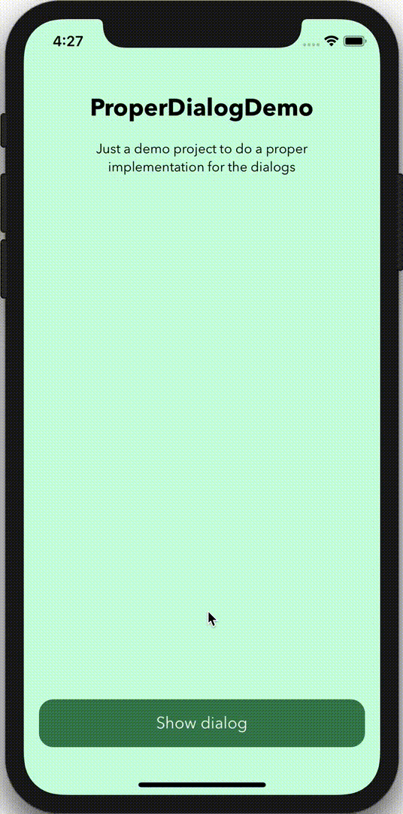

# MMDialogPopup
A UIViewController to easily show dialog popups in iOS



## Usage

#### Installing MMDialogPopup
Download the MMDialogPopupViewController.swift file and put it somewhere appropriate in your project

#### Showing a DialogPopup
Create an instance of MMDialogPopViewController, and then pass in your view controller (The one you want to show as a popup),
and then call `.show(onViewController:)` on it. 

```
let dialogPopup = MMDialogPopupViewController(contentViewControler: yourViewController)
dialogPopup.show(onViewController: self)
```

#### Conforming to MMDialogPopupDelegate
Conforming to this delegate gives you the ability to change `allowTapToDismiss`, and to access the `popupViewController` to close it.

#### Popup customization
Public properties can be modified for MMDialogPopupViewController

## Author
Mario Amgad Mouris, marioamgad9@gmail.com

## Disclaimer
This view controller is heavily influnced by [Steve Barnegren's](https://github.com/SteveBarnegren/SBCardPopup) one 
